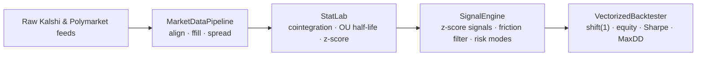

# Prediction-Market Statistical Arbitrage

A fully **vectorized statistical-arbitrage research stack** for binary prediction
markets. It detects mispricings of the *same event* across two venues
(**Kalshi** and **Polymarket**), models the price spread as a mean-reverting
process, trades it on a rolling z-score with a transaction-cost filter and two
risk regimes, and backtests the result with strict look-ahead controls.

---

## Executive summary

Two exchanges frequently quote the **same underlying event** (e.g. *"Will the Fed
hold rates?"* or *"Who wins the election?"*). When their implied probabilities
diverge, a market-neutral **spread trade** — long the cheap leg, short the rich
leg — profits as the gap reverts. This project implements the full research
pipeline for that idea:

| Stage | Module | What it does |
|------|--------|--------------|
| **1. Ingest & align** | [`src/data_pipeline.py`](src/data_pipeline.py) | Sync two raw, irregularly-clocked feeds onto a uniform time grid; forward-fill each venue; compute the spread. |
| **2. Statistics** | [`src/stat_lab.py`](src/stat_lab.py) | Engle–Granger cointegration test; Ornstein–Uhlenbeck **half-life of mean reversion**; 60-period rolling **z-score**. |
| **3. Signals** | [`src/signal_engine.py`](src/signal_engine.py) | Vectorized entry/exit (±2σ → mean), a **transaction-friction profitability filter**, and two risk modes (*indefinite hold* / *stop-loss with re-entry lockout*). |
| **4. Backtest** | [`src/backtester.py`](src/backtester.py) | Look-ahead-free (`shift(1)`) execution, additive P&L equity curve, **annualized Sharpe**, **maximum drawdown**. |

**Platforms.** Kalshi quotes in **cents (0–100)** and Polymarket in **dollars
(0–1)**. The pipeline is venue-agnostic, but the reference data adapter uses the
[`pmxt`](https://github.com/pmxt-dev/pmxt) library ("CCXT for prediction
markets"), which **normalizes both venues to a 0–1 probability scale** — the key
enabler that makes a cross-venue spread meaningful without manual unit
conversion. (The committed demos run on synthetic data and need no API access.)



---

## Primary findings — the 2×2 matrix

The strategy is evaluated across **two markets × two risk modes**. Results below
are from `run_master.py` on a synthetic but realistic simulation (1-week Fed rate
market sampled at 1-minute bars; 6-month election market at 15-minute bars):

| Scenario                      | Total Return | Annualized Sharpe | Max Drawdown |
|:------------------------------|-------------:|------------------:|-------------:|
| Short-Term / Indefinite Hold  |     +504.7 % |             65.43 |       −6.6 % |
| Short-Term / Stop-Loss        |     +449.5 % |             45.67 |       −6.6 % |
| Long-Term / Indefinite Hold   |     +933.5 % |             17.36 |       −5.8 % |
| Long-Term / Stop-Loss         |     +704.6 % |             13.73 |       −6.5 % |

Annualized Sharpe, as a 2×2 (risk-free = 0 %, 252 trading days):

|              | Indefinite Hold | Stop-Loss |
|:-------------|----------------:|----------:|
| **Short-Term** |           65.43 |     45.67 |
| **Long-Term**  |           17.36 |     13.73 |

### Interpretation

- **Indefinite Hold dominates Stop-Loss on every metric, in both markets.** The
  stop-loss lowers return *and* Sharpe without improving drawdown.
- **Why:** with a **rolling-mean** z-score the strategy is *self-correcting* —
  the lookback mean adapts to a dislocation within the window, so most adverse
  excursions are temporary and revert. A stop simply exits early, locks in the
  loss, and pays a second round of fees. A stop-loss only earns its keep against
  genuine **non-reverting** breaks (overnight gap risk, true decointegration)
  that a rolling-window signal cannot absorb.
- **Fees are the dominant constraint.** Kalshi's ~1 % fee is large relative to
  typical spread dislocations; the friction filter (trade only when expected
  reversion profit exceeds round-trip cost) is what keeps the strategy positive.

> ⚠️ **These are illustrative results on synthetic AR(1) data**, which is far
> cleaner than real markets — the absolute Sharpe levels (~13–65) are optimistic
> and would be much lower live (slippage, latency, partial fills, regime shifts).
> The short-term Sharpe also rests on only ~7 daily returns and is statistically
> noisy. **The deliverable is the framework and methodology, not these numbers.**

---

## Repository structure

```
.
├── README.md
├── requirements.txt
├── LICENSE
├── run_master.py            # entry point — runs the full 2×2 scenario matrix
└── src/
    ├── data_pipeline.py     # MarketDataPipeline  (+ PmxtFeed live-data adapter)
    ├── stat_lab.py          # StatLab: cointegration, OU half-life, rolling z-score
    ├── signal_engine.py     # SignalEngine: signals, friction filter, risk modes
    └── backtester.py        # VectorizedBacktester: equity, Sharpe, max drawdown
```

---

## Installation

```bash
git clone <your-repo-url>
cd PredictionMarketAlphaGeneration
pip install -r requirements.txt        # pandas, numpy, statsmodels
```

## Usage

Run the full four-scenario comparison and print the Markdown table:

```bash
python run_master.py
```

Each module is **independently runnable** and prints a self-contained,
self-verifying demo:

```bash
python src/data_pipeline.py     # alignment + spread on synthetic feeds
python src/stat_lab.py          # cointegration + OU half-life + z-score
python src/signal_engine.py     # signal generation + stop-loss lockout
python src/backtester.py        # equity curve + Sharpe + drawdown
```

Wiring the stack on your own data:

```python
from data_pipeline import MarketDataPipeline
from stat_lab import StatLab
from signal_engine import SignalEngine
from backtester import VectorizedBacktester

synced  = MarketDataPipeline(freq="1min").synchronize(kalshi_df, polymarket_df)
lab     = StatLab(synced)
result  = lab.analyze()                                   # cointegration → OU if cointegrated
signals = SignalEngine(risk_mode="stop_loss", stop_z_score=3.5).run(lab, window=60)
bt      = VectorizedBacktester().run(signals)
print(bt.summary())                                       # sharpe, max_drawdown, total_return, ...
```

---

## Methodology notes

A few decisions that materially affect correctness:

- **Unit normalization.** Kalshi cents vs Polymarket dollars must be on one scale
  or the spread is meaningless; `pmxt` normalizes both to 0–1. The pipeline also
  warns if it detects two inputs on different scales.
- **Signed vs absolute spread.** Cointegration runs on the raw price series; the
  trading signal uses the **signed** spread `kalshi − polymarket` (direction is
  required to know which leg to buy). The absolute spread is exposed for
  diagnostics only.
- **No look-ahead.** Execution is `position.shift(1)` — the signal formed on bar
  *t*'s close is acted on at *t+1*. This is verified by a causality test
  (perturbing a signal changes no prior P&L).
- **Additive P&L.** A spread P&L is `position × Δspread` and the spread crosses
  zero, so percentage returns on it are undefined. The equity curve is additive
  and the daily return is the day's P&L over a fixed capital base — which keeps
  the Sharpe sign-correct and invariant to the capital assumption.
- **Stationarity guard.** The OU half-life is only reported as reliable when the
  spread passes an ADF unit-root test (a plain normal *t*-test on the AR(1)
  coefficient is invalid near a unit root and would flag random walks as
  mean-reverting).

Every quantitative claim in the codebase is checked against an independent
oracle or a hand computation (cointegration controls, OU half-life recovery, the
vectorized signal state-machine vs. a stateful loop, the no-look-ahead causality
test, and Sharpe/drawdown reference calculations).

---

## Limitations & disclaimer

- The committed datasets are **synthetic**; no live market data is included.
- A production deployment would need: live `pmxt` data, explicit slippage /
  latency / partial-fill modeling, YES/NO outcome-orientation matching across
  venues, and walk-forward (out-of-sample) parameter validation.
- **This is a research / educational project, not investment advice.** Trading
  prediction markets carries risk; nothing here is a recommendation.

## License

Released under the [MIT License](LICENSE).
