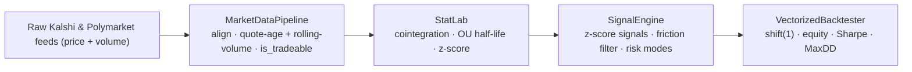
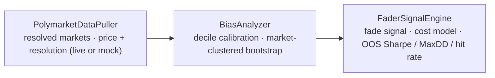

# Prediction-Market Statistical Arbitrage

A fully **vectorized statistical-arbitrage research stack** for binary prediction
markets. It detects mispricings of the *same event* across two venues
(**Kalshi** and **Polymarket**), models the price spread as a mean-reverting
process, trades it on a rolling z-score with a transaction-cost filter and two
risk regimes, and backtests the result with strict look-ahead controls.

It also ships a **second, independent strategy** — a single-venue **favorite-longshot
bias** fader (fade over-priced longshots, back under-priced favorites). See the
*Favorite-Longshot Bias* section below.

---

## Executive summary

Two exchanges frequently quote the **same underlying event** (e.g. *"Will the Fed
hold rates?"* or *"Who wins the election?"*). When their implied probabilities
diverge, a market-neutral **spread trade** — long the cheap leg, short the rich
leg — profits as the gap reverts. This project implements the full research
pipeline for that idea:

| Stage | Module | What it does |
|------|--------|--------------|
| **1. Ingest & align** | [`src/data_pipeline.py`](src/data_pipeline.py) | Sync two raw Price+Volume feeds onto a uniform grid; track each venue's quote age and rolling volume to flag stale/illiquid minutes (`is_tradeable`), eliminating phantom liquidity. |
| **2. Statistics** | [`src/stat_lab.py`](src/stat_lab.py) | Engle–Granger cointegration test; Ornstein–Uhlenbeck **half-life of mean reversion**; 60-period rolling **z-score**. |
| **3. Signals** | [`src/signal_engine.py`](src/signal_engine.py) | Vectorized entry/exit (±2σ → mean), a **transaction-friction profitability filter**, and two risk modes (*indefinite hold* / *stop-loss with re-entry lockout*). |
| **4. Backtest** | [`src/backtester.py`](src/backtester.py) | Look-ahead-free (`shift(1)`) execution **intersected with `is_tradeable`** (never fills on stale/illiquid quotes), additive P&L equity curve, **annualized Sharpe**, **max drawdown**, win rate, % capital locked. |
| **5. Walk-forward** | [`src/walk_forward.py`](src/walk_forward.py) | Expanding-window walk-forward: per step, re-select the rolling window (from the OU half-life) and entry-z that maximize *friction-adjusted* Sharpe in-sample, then apply them strictly to the next out-of-sample day. No hardcoded parameters. |
| **6. Execution** | [`src/execution_engine.py`](src/execution_engine.py) | Prediction-market reality: no native short (a "short" buys the **NO** leg), a fully-collateralized capital tracker that **blocks entries when cash is locked**, and **hold-to-resolution** P&L (no early close unless bid/ask data prices the slippage). The honest counterpart to the mark-to-market backtester. |

**Platforms.** Kalshi quotes in **cents (0–100)** and Polymarket in **dollars
(0–1)**. The pipeline is venue-agnostic, but the reference data adapter uses the
[`pmxt`](https://github.com/pmxt-dev/pmxt) library ("CCXT for prediction
markets"), which **normalizes both venues to a 0–1 probability scale** — the key
enabler that makes a cross-venue spread meaningful without manual unit
conversion. (The committed demos run on synthetic data and need no API access.)



---

## Primary findings — the 2×2 matrix

The strategy is evaluated across **two markets × two risk modes**. Results below
are from `run_master.py` on a synthetic but realistic simulation (1-week Fed rate
market sampled at 1-minute bars; 6-month election market at 15-minute bars):

| Scenario                      | Total Return | Annualized Sharpe | Max Drawdown |
|:------------------------------|-------------:|------------------:|-------------:|
| Short-Term / Indefinite Hold  |     +504.7 % |             65.43 |       −6.6 % |
| Short-Term / Stop-Loss        |     +449.5 % |             45.67 |       −6.6 % |
| Long-Term / Indefinite Hold   |     +933.5 % |             17.36 |       −5.8 % |
| Long-Term / Stop-Loss         |     +704.6 % |             13.73 |       −6.5 % |

Annualized Sharpe, as a 2×2 (risk-free = 0 %, 252 trading days):

|              | Indefinite Hold | Stop-Loss |
|:-------------|----------------:|----------:|
| **Short-Term** |           65.43 |     45.67 |
| **Long-Term**  |           17.36 |     13.73 |

### Interpretation

- **Indefinite Hold dominates Stop-Loss on every metric, in both markets.** The
  stop-loss lowers return *and* Sharpe without improving drawdown.
- **Why:** with a **rolling-mean** z-score the strategy is *self-correcting* —
  the lookback mean adapts to a dislocation within the window, so most adverse
  excursions are temporary and revert. A stop simply exits early, locks in the
  loss, and pays a second round of fees. A stop-loss only earns its keep against
  genuine **non-reverting** breaks (overnight gap risk, true decointegration)
  that a rolling-window signal cannot absorb.
- **Fees are the dominant constraint.** Kalshi's ~1 % fee is large relative to
  typical spread dislocations; the friction filter (trade only when expected
  reversion profit exceeds round-trip cost) is what keeps the strategy positive.

> ⚠️ **These are illustrative results on synthetic AR(1) data**, which is far
> cleaner than real markets — the absolute Sharpe levels (~13–65) are optimistic
> and would be much lower live (slippage, latency, partial fills, regime shifts).
> The short-term Sharpe also rests on only ~7 daily returns and is statistically
> noisy. **The deliverable is the framework and methodology, not these numbers.**

---

## Out-of-Sample Tear Sheet (`master_oos.py`)

`master_oos.py` runs the full chain **walk-forward → `shift(1)` → `is_tradeable`
intersection → backtest** and prints an Out-of-Sample Performance Tear Sheet from
**real pmxt market data**. With a `PMXT_API_KEY` (or explicit market slugs) it
produces genuine, strictly out-of-sample numbers.

> ⚠️ **The tear sheet below is ILLUSTRATIVE — synthetic data, NOT real results.**
> In testing, pmxt's live cross-venue matcher only surfaced sparse, long-dated
> markets (a handful of candles each) — not the months of overlapping
> Kalshi↔Polymarket history a 30-day walk-forward needs. So the numbers shown are
> from `python master_oos.py --illustrative` (synthetic), purely to demonstrate
> the output format and that the methodology is strictly out-of-sample. For
> genuine figures, point the script at a liquid market with real history:
> `KALSHI_SLUG=… POLYMARKET_SLUG=… python master_oos.py`.

| Metric | Value *(illustrative / synthetic)* |
|:-----------------------------|------:|
| OOS Annualized Sharpe Ratio  | 12.81 |
| Maximum Drawdown             | −6.9 % |
| Percentage of Capital Locked | 38.6 % |
| Win Rate (executed trades)   | 85.0 % |

*Walk-forward: expanding 30-day train / 1-day OOS, 30 folds; the rolling window and
entry-z are re-selected each fold from the OU half-life by maximizing
friction-adjusted Sharpe. Execution shifts signals one period (no look-ahead) and
intersects them with `is_tradeable` so nothing trades on a stale/illiquid quote.*

### Real-data status — attempted, data-blocked

Running the **hardened** `master_oos.py` against the live pmxt API with a real
`PMXT_API_KEY` (both the cross-venue matcher and the explicit `--discover` / slug
paths, across resolutions and a multi-month lookback) **did not return enough
overlapping Kalshi↔Polymarket history to compute a defensible out-of-sample result** —
so the script **failed loudly rather than fabricate a number.** This is a
*data-availability* limit, not a methodology one: pmxt's live OHLCV surfaces mostly
sparse, long-dated markets, and the deepest books (e.g. the 2024 election) traded too
long ago for the live endpoint to still serve their full candle history.

The pipeline is built for the moment that changes. `master_oos.py` prints a
**data-provenance** block (tradeable vs total bars, overlap window, walk-forward folds,
% of OOS bars traded) and a **signal-vs-noise** check — a significance floor of
`2·√(252/n)` on the `n` out-of-sample daily returns — so a real run either yields a
defensible figure or states plainly that it is noise. Reaching genuine depth would mean
pulling from the venues' own historical endpoints (Polymarket's CLOB `/prices-history`
plus a Kalshi candlestick fetcher) rather than the live matcher.

---

## Second strategy — Favorite-Longshot Bias (single-venue alpha)

The repo also includes a **second, independent strategy** that monetizes a structural
inefficiency *within a single venue* rather than a cross-venue spread: the
**favorite-longshot bias (FLB)**. Across betting and prediction markets, prices map to
outcomes in a regular, exploitable way — **longshots are systematically over-priced**
(a contract at an implied 5 % resolves YES *less* than 5 % of the time) and **favorites
are under-priced**. The edge is to **fade longshots / back favorites**, sized by the
measured miscalibration.

| Stage | Module | What it does |
|------|--------|--------------|
| **A. Data** | [`src/alpha_engine.py`](src/alpha_engine.py) | `PolymarketDataPuller` pulls **resolved** Polymarket markets (Gamma API for metadata + resolution, CLOB for price history) with production-grade **retry / backoff / rate-limit** handling, yielding each market's implied-probability **price time-series** + binary **resolution**. Ships a **mock generator** that bakes in a tunable favorite-longshot bias so the whole stack runs offline. |
| **B. Statistics** | [`src/bias_analyzer.py`](src/bias_analyzer.py) | `BiasAnalyzer` buckets implied probabilities into **deciles**, computes the **realized win rate** per decile, and a **market-clustered bootstrap** confidence interval — resampling *whole markets*, because a market's many price points share one outcome and are **not** independent. Renders the **calibration curve** against the 45° efficiency line. |
| **C. Signal + backtest** | [`src/fader_signal_engine.py`](src/fader_signal_engine.py) | `FaderSignalEngine` fires a systematic **fade** (buy the NO leg) when `implied < threshold` **and** the bucket's **historical** realized rate `< threshold`; computes theoretical hold-to-resolution P&L net of an **extremes-aware cost model**; reports **out-of-sample Sharpe, max drawdown, and hit rate**. |



### The trade — and why costs decide it

Fading a longshot YES at price `p` means **buying the NO contract** at `1 − p` (no native
short, the same convention as the cross-venue execution engine) and **holding to
resolution**. Per contract the gross P&L is `p − y` (YES resolution `y ∈ {0,1}`): you win
a little (`+p`) most of the time and lose a lot (`−(1−p)`) rarely — a **negatively skewed**
payoff in which costs and tail risk, not just mean edge, decide profitability.

Because the position settles at \$0/\$1, costs are paid **once, on entry**:

```
cost(p) = half_spread(p)            # crossing the bid/ask, WIDENING toward the extremes
        + impact_coef · size        # linear market impact (thin books)
        + fee_rate · min(p, 1 − p)  # Polymarket's symmetric fee (≈0 historically; configurable)
```

The half-spread widens as `p → 0/1` (the thin 2–3 ¢ extremes), while the symmetric fee is
*largest at 0.50* — the model captures both. At the extremes the liquidity cost is
proportionally largest exactly where the alpha lives.

### Illustrative results

> ⚠️ **Synthetic, illustrative — NOT real results.** The mock panel injects a
> *stronger-than-real* bias and draws **independent** outcomes (so real *clustered* tail
> risk is understated). Numbers below are from the module demos and `research.ipynb`.

Calibration (`python src/bias_analyzer.py`, 1,500-market panel, market-clustered 95 % CI)
recovers a clean monotone bias — every low decile resolves **below** its implied price,
every high decile **above** — with a pooled calibration slope of **+0.16** (a calibrated
control shows ≈ 0). The clustered CI is **~5× wider** than a naive row-level bootstrap, the
honest correction for within-market correlation.

Fading the longshots, **strictly out-of-sample** (`python src/fader_signal_engine.py` —
calibrate on earlier markets, fade later ones):

| Metric *(illustrative / synthetic)* | Value |
|:--|--:|
| Hit rate | ~99 % |
| Gross edge / contract | +5.5 ¢ |
| Cost / contract | 1.4 ¢ (≈ 25 % of edge) |
| Net edge / contract | +4.1 ¢ |
| Annualized Sharpe | gross 8.1 → **net 6.7** |
| Max drawdown | −0.6 % |

**The real finding is the sensitivity, not the Sharpe.** Raising the cost assumptions to a
genuinely thin 2–3 ¢ book (wider extreme spread, higher impact) **flips the net edge
negative — the alpha is erased.** That knife-edge is the point.

### Rigor

- **No look-ahead.** The "historical realized" gate is fit on markets resolving *before*
  the traded ones; the fade decision uses only information available at trade time.
- **Cluster bootstrap.** Confidence intervals resample whole markets, so a decile backed by
  few distinct markets reads as *uncertain* rather than falsely tight.
- **Gross vs. net everywhere.** Every metric is reported net of costs with a cost-free
  counterpart, so the cost drag is explicit.

### Real-data result — tested on Polymarket, no demonstrable edge

The stack was pointed at **real resolved Polymarket markets** via
[`master_flb_oos.py`](master_flb_oos.py) (Gamma + CLOB, real-data-only). The honest
out-of-sample finding is a **null**:

- **Data is the binding constraint.** Of 1,500 highest-volume resolved binaries, only
  **183 (12 %) had any CLOB price history, all within a single ~30-day window** (CLOB
  doesn't serve older prices via this path). The fade zone (price < 0.10) held just
  **36 markets — 12 out-of-sample** — far too thin for a high-variance longshot fade.
- **No bias where the strategy trades.** In the lowest decile the realized rate (0.019)
  matched the implied price (0.016): edge **+0.003, CI includes zero**; 7/10 deciles'
  edges sat within the bootstrap CI of zero; the pooled calibration slope was
  **−0.16 — the *opposite* sign to the textbook bias.**
- **Directionally real but economically dead.** All **12/12** faded longshots resolved
  NO (as the bias predicts) — but **9 of 12 were priced below the ~1.3 ¢ round-trip cost
  of trading them**, so fading a \$0.0005 contract loses money even when it resolves NO.
  Net edge **−0.18 ¢/contract, 95 % CI [−1.02 ¢, +1.02 ¢]** at default costs (and −4.1 ¢
  at a realistic thin-book cost): **statistically indistinguishable from zero**.

> **Verdict: noise, not signal.** The synthetic demo proves the *pipeline* works; the
> real data shows **no demonstrable, capturable favorite-longshot edge** — the bias
> survives directionally but lives at prices below the cost of trading it, on a sample
> far too small (and too recency-clustered) to conclude otherwise. A near-zero/negative
> honest result, reported as such.

---

## Repository structure

```
.
├── README.md
├── requirements.txt
├── LICENSE
├── run_master.py            # 2×2 scenario matrix (illustrative, synthetic)
├── master_oos.py            # Out-of-Sample tear sheet — real pmxt data (--illustrative for synthetic demo)
├── master_flb_oos.py        # [FLB] real-data favorite-longshot OOS driver + cost-sensitivity sweep (real data only)
├── research.ipynb           # Jupyter notebook — cointegration, reversion, equity & favorite-longshot calibration
└── src/
    ├── data_pipeline.py     # MarketDataPipeline  (+ PmxtFeed live-data adapter)
    ├── stat_lab.py          # StatLab: cointegration, OU half-life, rolling z-score
    ├── signal_engine.py     # SignalEngine: signals, friction filter, risk modes
    ├── backtester.py        # VectorizedBacktester: shift(1) + is_tradeable, Sharpe, drawdown, win rate
    ├── walk_forward.py      # WalkForwardOptimizer: expanding-window parameter optimization
    ├── execution_engine.py  # ExecutionEngine: collateralized, hold-to-resolution execution
    │
    ├── alpha_engine.py         # [FLB] PolymarketDataPuller: resolved-market puller + biased mock generator
    ├── bias_analyzer.py        # [FLB] BiasAnalyzer: decile calibration + market-clustered bootstrap
    ├── fader_signal_engine.py  # [FLB] FaderSignalEngine: fade signal, cost model, OOS tear sheet
    └── reversion_diagnostic.py # mean-reversion vs held-to-resolution diagnostic (cross-venue)
```

---

## Installation

```bash
git clone <your-repo-url>
cd PredictionMarketAlphaGeneration
pip install -r requirements.txt        # pandas, numpy, statsmodels
```

## Usage

Run the full four-scenario comparison and print the Markdown table:

```bash
python run_master.py
```

Print the Out-of-Sample tear sheet — real pmxt data (needs `PMXT_API_KEY` or slugs),
or a clearly-labeled synthetic illustration:

```bash
KALSHI_SLUG=<ticker> POLYMARKET_SLUG=<slug> python master_oos.py   # real data
python master_oos.py --illustrative                                # synthetic demo
```

Or explore the visual research notebook (cointegration, mean reversion, equity curves):

```bash
jupyter notebook research.ipynb
```

Each module is **independently runnable** and prints a self-contained,
self-verifying demo:

```bash
python src/data_pipeline.py     # alignment + spread on synthetic feeds
python src/stat_lab.py          # cointegration + OU half-life + z-score
python src/signal_engine.py     # signal generation + stop-loss lockout
python src/backtester.py        # equity curve + Sharpe + drawdown
python src/walk_forward.py      # walk-forward optimization -> out-of-sample signal
python src/execution_engine.py  # collateralized prediction-market execution

python src/alpha_engine.py         # [FLB] favorite-longshot mock panel + calibration table
python src/bias_analyzer.py        # [FLB] decile calibration + market-clustered bootstrap CI
python src/fader_signal_engine.py  # [FLB] fade-the-longshot backtest: Sharpe / MaxDD / hit rate

pip install requests && python master_flb_oos.py   # [FLB] REAL Polymarket OOS test (Gamma + CLOB) + cost sweep
```

Wiring the stack on your own data:

```python
from data_pipeline import MarketDataPipeline
from stat_lab import StatLab
from signal_engine import SignalEngine
from backtester import VectorizedBacktester

synced  = MarketDataPipeline(freq="1min").synchronize(kalshi_df, polymarket_df)
lab     = StatLab(synced)
result  = lab.analyze()                                   # cointegration → OU if cointegrated
signals = SignalEngine(risk_mode="stop_loss", stop_z_score=3.5).run(lab, window=60)
bt      = VectorizedBacktester().run(signals)
print(bt.summary())                                       # sharpe, max_drawdown, total_return, ...
```

---

## Methodology notes

A few decisions that materially affect correctness:

- **Unit normalization.** Kalshi cents vs Polymarket dollars must be on one scale
  or the spread is meaningless; `pmxt` normalizes both to 0–1. The pipeline also
  warns if it detects two inputs on different scales.
- **Signed vs absolute spread.** Cointegration runs on the raw price series; the
  trading signal uses the **signed** spread `kalshi − polymarket` (direction is
  required to know which leg to buy). The absolute spread is exposed for
  diagnostics only.
- **No look-ahead.** Execution is `position.shift(1)` — the signal formed on bar
  *t*'s close is acted on at *t+1*. This is verified by a causality test
  (perturbing a signal changes no prior P&L).
- **Additive P&L.** A spread P&L is `position × Δspread` and the spread crosses
  zero, so percentage returns on it are undefined. The equity curve is additive
  and the daily return is the day's P&L over a fixed capital base — which keeps
  the Sharpe sign-correct and invariant to the capital assumption.
- **Stationarity guard.** The OU half-life is only reported as reliable when the
  spread passes an ADF unit-root test (a plain normal *t*-test on the AR(1)
  coefficient is invalid near a unit root and would flag random walks as
  mean-reverting).

Every quantitative claim in the codebase is checked against an independent
oracle or a hand computation (cointegration controls, OU half-life recovery, the
vectorized signal state-machine vs. a stateful loop, the no-look-ahead causality
test, and Sharpe/drawdown reference calculations).

---

## Limitations & disclaimer

- All committed metrics (the 2×2 matrix, the cross-venue tear sheet, and the
  favorite-longshot results) are **illustrative, on synthetic data**. A real cross-venue
  out-of-sample tear sheet was **attempted and is currently data-blocked**: with a live
  `PMXT_API_KEY`, the hardened `master_oos.py` could not pull enough overlapping
  Kalshi↔Polymarket history and **fails loudly rather than fabricate** (see "Real-data
  status — attempted, data-blocked" above). The pipeline is ready to produce genuine
  out-of-sample figures the moment a deep enough source — e.g. the venues' own historical
  endpoints — is wired in.
- The **favorite-longshot** strategy was **tested on real Polymarket data**
  (`master_flb_oos.py`, Gamma + CLOB) and showed **no demonstrable, capturable edge**: the
  out-of-sample net-of-cost edge was statistically indistinguishable from zero on a panel
  where only 12 % of markets had price history (all within ~30 days) and the bias, though
  directionally present, lived at prices below the cost of trading it. The committed
  *synthetic* FLB numbers exercise the pipeline; they are **not** a claim of live alpha.
- A production deployment would need: live `pmxt` data, explicit slippage /
  latency / partial-fill modeling, YES/NO outcome-orientation matching across
  venues, and walk-forward (out-of-sample) parameter validation.
- **This is a research / educational project, not investment advice.** Trading
  prediction markets carries risk; nothing here is a recommendation.

## License

Released under the [MIT License](LICENSE).
